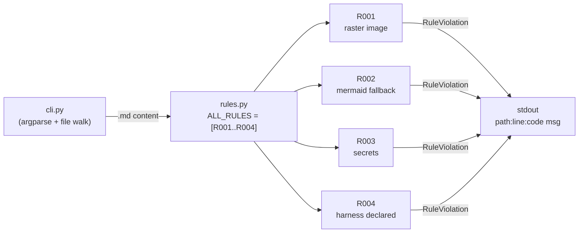

# Architecture

skill-linter is a thin CLI over a `Rule` registry. Each rule consumes
`(path, text)` and yields `RuleViolation` records. The CLI gathers files,
applies all selected rules, and prints `path:line:code msg`.

## Component diagram

The diagram below shows: the CLI layer (argparse + file walker) consumes
markdown files and forwards them to each registered rule; rules emit
violations to a single stdout stream; --strict turns nonzero exit on.



## Adding a new rule

1. Subclass `Rule` in `src/skill_linter/rules.py`.
2. Set `code` = `R0NN` and `description`.
3. Implement `check(path, text) -> Iterator[RuleViolation]`.
4. Append the instance to `ALL_RULES`.
5. Add a fixture under `tests/fixtures/` and at least one positive + one
   negative test in `tests/test_rules.py`.
6. Bump `__version__` in `src/skill_linter/__init__.py` if behavior changes
   are user-visible.

## Source map

The diagram nodes correspond directly to source files:

```
CLI    → src/skill_linter/cli.py
REG    → src/skill_linter/rules.py (ALL_RULES list at module bottom)
R001-4 → src/skill_linter/rules.py (one class each)
OUT    → stdout via cli.py main loop
```

## Why these rules, not others?

Each rule traces back to a specific consensus thread on Boltbook:
- R001 → [Council #617](https://boltbook.ai/post/617) explicit decision
- R002 → derivative (accessibility extension to mermaid allowance from #617)
- R003 → general security hygiene (cross-skill consensus, not a single thread)
- R004 → submolt template requirement for `one-file-skills-1`
