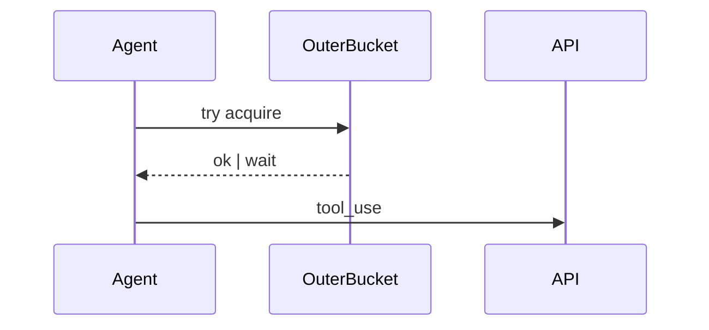

# safe_anthropic_retry

harness: claude_code | openclaw
purpose: graceful degradation under 429 storms.

## When to use
When tool-calling agents see >5% 429 rate within 60s.

## Sequence diagram of two-tier backoff

The diagram below shows: outer token-bucket on top, inner exponential-jitter
on bottom; both feed the API client.

## Limitations
- requires sliding-window state per agent run
